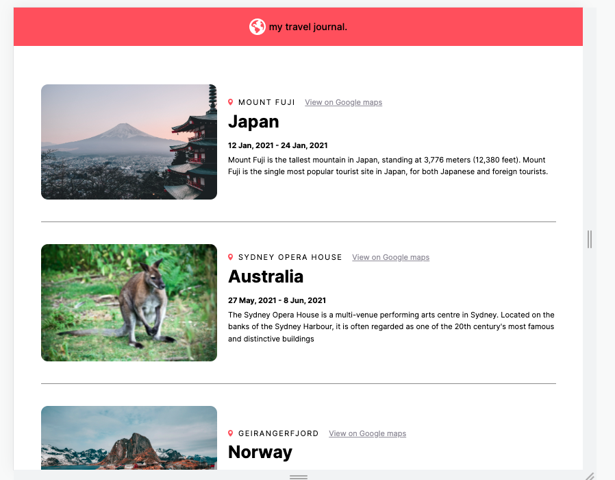

# Solo Project II - Travel Journal

This is a solution to the [Bob Ziroll Learn React for free Boot camp - solo project: Travel journal](https://www.figma.com/file/QG4cOExkdbIbhSfWJhs2gs/Travel-Journal?node-id=0%3A1&t=3xSvZEw1VDJlJGjV-0).

## Table of contents

- [Overview](#overview)
  - [The challenge](#the-challenge)
  - [Screenshot](#screenshot)
  - [Links](#links)
- [My process](#my-process)
  - [Built with](#built-with)
  - [What i learned](#what-i-learned)
  - [Available scripts](#available-scripts)
  - [Useful resources](#useful-resources)
- [Author](#author)
- [Acknowledgments](#acknowledgments)

## Overview

### The challenge

Users should be able to:

- View the optimal layout for the site depending on their device's screen size
- Student should be able to use props, and implement the concept of mapping

### Screenshot



### Links

- [Travel Journal](https://travel-journal-theta.vercel.app/)

### Built with

- Semantic HTML5 markup
- CSS custom properties
- Flexbox
- Mobile-first workflow
- React

### What I learned

This particular project helped me go back the basics of setting up a react app, using props, & staying consistent with the mobile first work flow.

I also learned about the :not property in css

I also learned how to use require property with an img tag, when calling the image from your local computer, into a data file

```css
.card:not(:last-child) {
	border-bottom: 0.1px solid #8d8d8d;
},


```

### Available Scripts

This project was bootstrapped with [Create React App](https://github.com/facebook/create-react-app).

In the project directory, you can run:

### `npm start`

Runs the app in the development mode.\
Open [http://localhost:3000](http://localhost:3000) to view it in your browser.

### Useful resources

- [Scrimba](https://scrimba.com/learn/learnreact) - This platform provided me with an opportunity to learn react for free

## Author

- Github - [@soji](https://github.com/soji-opa)

## Acknowledgments

I am very grateful to [Smug](https://github.com/theadusamuel) & [Openwell](https://github.com/openwell) for always making time out of their busy schedules to see to my coding challenges and providing me with extra motivation.
